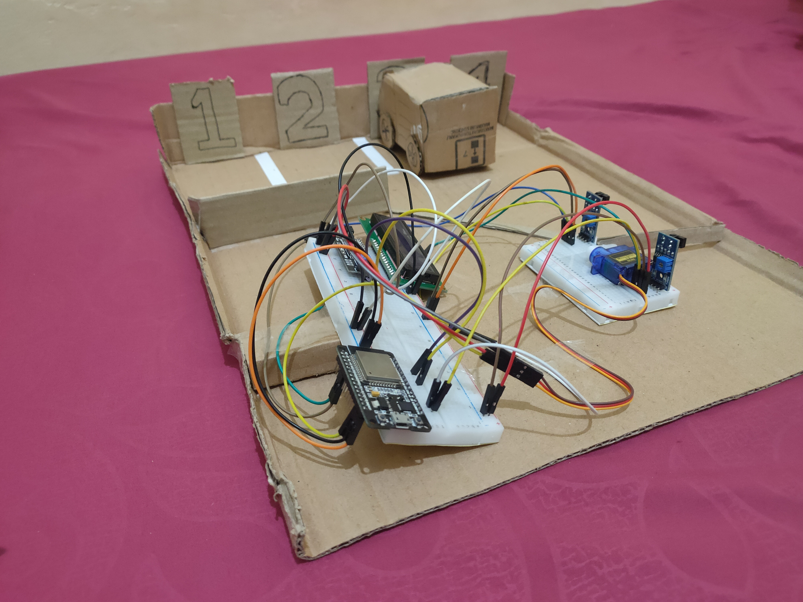
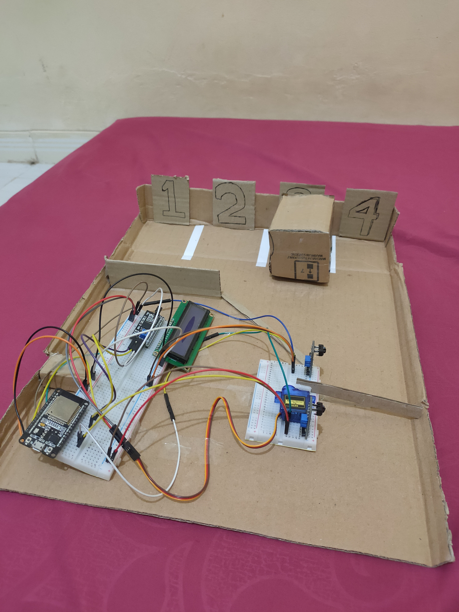

# Sistem Parkir Pintar Berbasis IOT

#### Tugas Besar Mata Kuliah IOT Energy

## Hasil Purwarupa

<div align="center">
  
  
</div>

## Anggota

- M. Riski Aziz
- Muhammad A.M Hikar Syahrial
- Yusril Iskandar Harahap

## Download Source Code

```
$ git clone https://github.com/mriskiaziz/Sistem-Parkir-Pintar-Berbasis-IOT.git
```

## Alat dan Bahan

| Nama Alat | Jumlah |
| --------- | :----: |
| ESP32     |   1    |
| IR Sensor |   2    |
| LCDx16    |   1    |
| Servo     |   1    |
| Kardus    |   -    |
